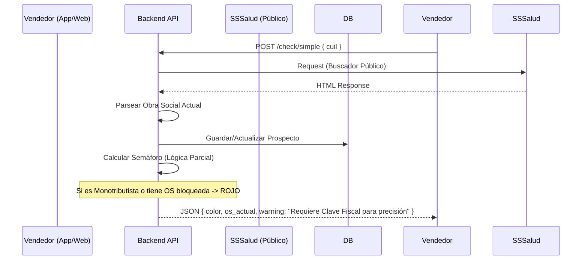
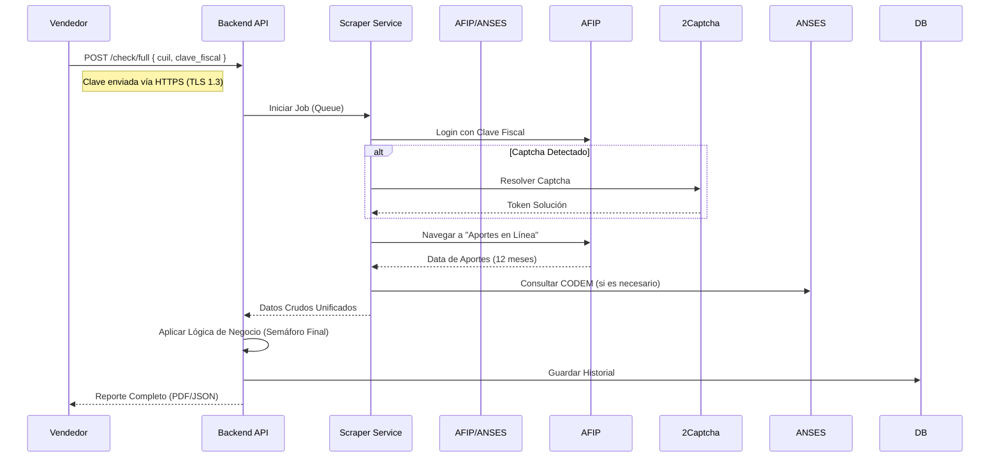

# Diagrama de Flujo de Autenticación y Scraping

## 1. Flujo de Consulta Simple (Solo CUIL)

Este flujo se usa para una pre-calificación rápida sin pedir datos sensibles al cliente.

## 2. Flujo de Consulta Completa (Con Clave Fiscal)

Este flujo confirma los aportes y la fecha exacta de traspaso.

## 3. Lógica del Semáforo (Business Logic)

| Estado | Condición | Acción Sugerida |
| :--- | :--- | :--- |
| **VERDE** | Activo, Aportes al día, Último cambio > 12 meses | **VENDER** |
| **AMARILLO** | Cambio hace 11 meses OR Aportes irregulares | **AGENDAR ALERTA** |
| **ROJO** | Cambio < 11 meses, Desempleado, Monotributo Social | **DESCARTAR** |
